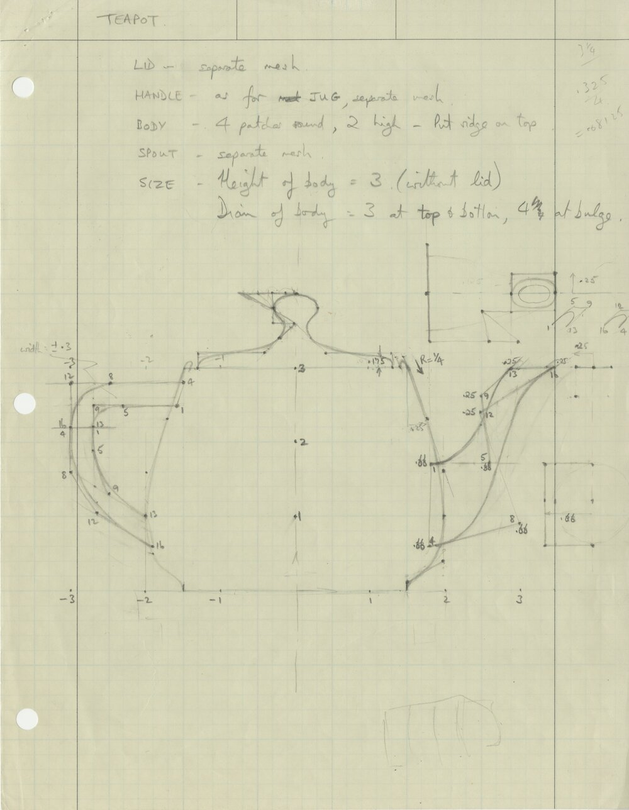
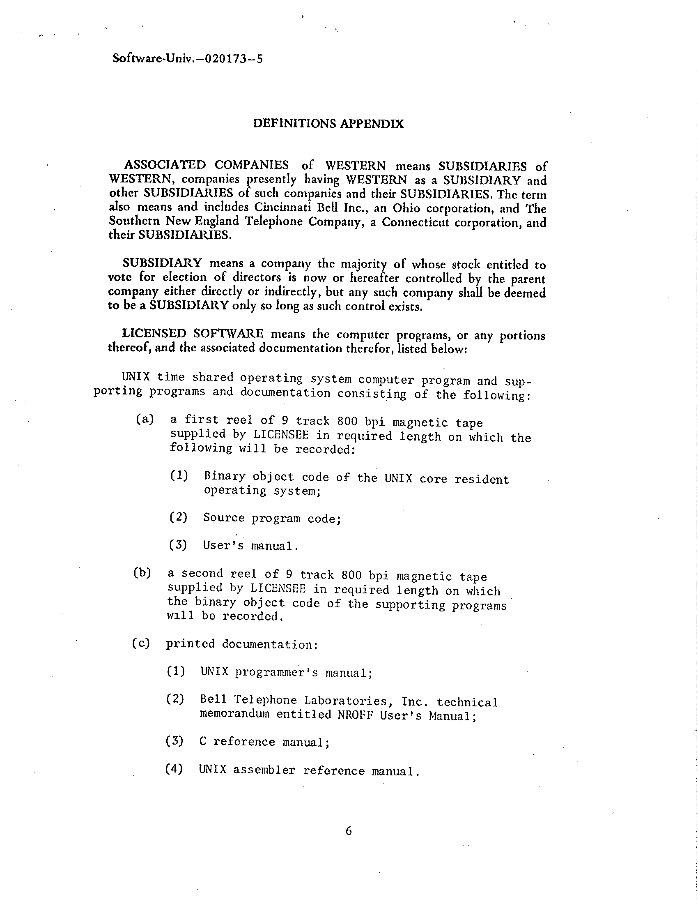

# UNIX V4 at the University of Utah

by Thalia Archibald, December 2025

This summer, Aleks Maricq found a magnetic tape labeled "UNIX V4 DIST" at the
University of Utah.

The Flux Research Group is moving next year when the new engineering building is
completed and has been cleaning old documents to prepare.

The tape was acquired at the dawn of computer graphics and considered for use in
pioneering work. Just a year later the Utah Teapot was modeled. But, UNIX was
not mature enough yet, so the tape was not used for any work and forgotten.
Perhaps this neglect allowed it to survive to today. My theory is that it was
placed in a tape rack, untouched and never overwritten. Then, after magnetic
tapes were obsolete Jay Lepreau probably saw the "UNIX V4 DIST" while cleaning
and, being the operating systems researcher that he was, saved it, writing his
own label.

Events:
- Paul Abegglen letter to Ritchie, 21 November 1973
- Martin Newell setting up new facility with PDP-11/45, 1973
- UNIX V4 license agreement affective, estimated December 1973
- PDP-11/45 in "Man Machine Communication in Three Dimensions", March 1974
- UNIX V4 delivery letter, 31 May 1974
- Utah Teapot modeled, circa 1975
- Teapot in "Texture and Reflection in Computer Generated Images", July 1976
- E&S PS-2 UNIX driver, manual dated October 1978
- Randy Frank and Spencer Thomas at Boulder USENIX, 28 January – 2 February 1980
- SLC POSIX meeting, 23–27 April 1991

https://www.tuhs.org/Archive/Applications/Dennis_Tapes/Gao_Analysis/v4_dist/setup.pdf

My first lead was when I found UNIX News mentioned in ["Unix at 25"](https://web.archive.org/web/19961220135639/http://www.byte.com/art/9410/sec8/art3.htm),
by Peter H. Salus for BYTE magazine.

<!--  -->

A machine-readable list of licensees was also maintained by Ken Thompson,
modified a month before this, which I am [analyzing](https://github.com/thaliaarchi/unix-form-read).

https://archive.org/search?query=subject%3A%22UNIX+license%22&sort=date

