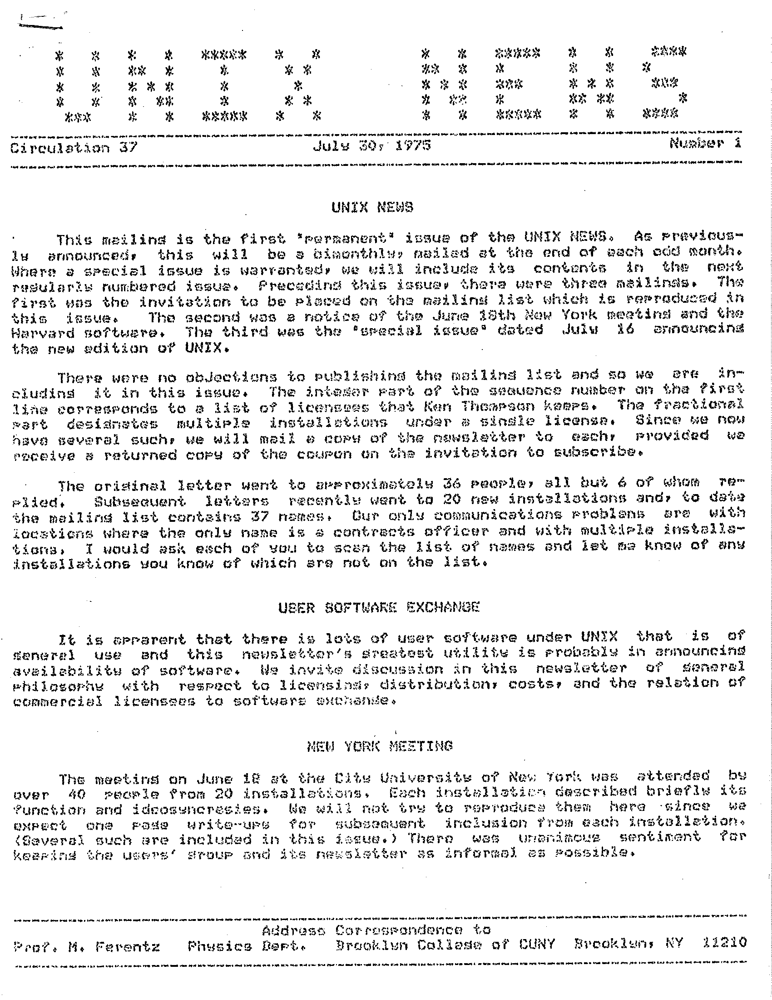
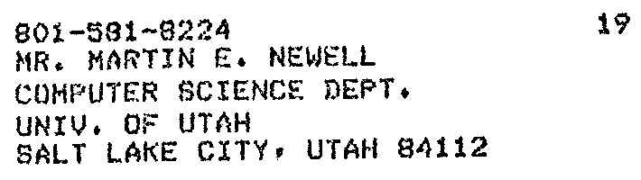

# UNIX V4 at the University of Utah

by Thalia Archibald, December 2025

This summer, Aleks Maricq found a magnetic tape labeled "UNIX V4 DIST" at the
University of Utah.

The Flux Research Group is moving next year when the new engineering building is
completed and has been cleaning old documents to prepare.

Events:
- Teapot
- PS-2 UNIX driver
- Boulder USENIX
- SLC USENIX

https://www.tuhs.org/Archive/Applications/Dennis_Tapes/Gao_Analysis/v4_dist/setup.pdf

My first lead was when I found UNIX News mentioned in ["Unix at 25"](https://web.archive.org/web/19961220135639/http://www.byte.com/art/9410/sec8/art3.htm),
by Peter H. Salus for BYTE magazine.

